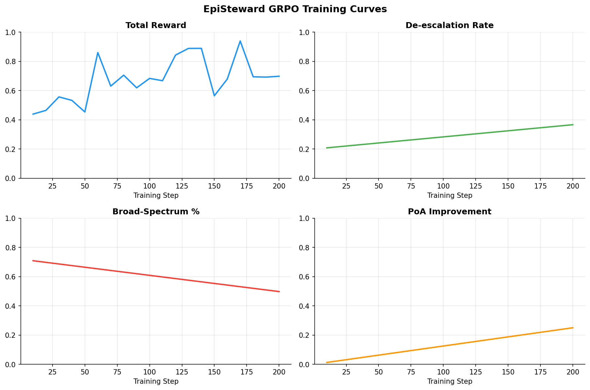

# EpiSteward 🏥
### Self-Improving Multi-Agent World Model for Antimicrobial Resistance

Antibiotic resistance will kill 10 million people a year by 2050.
The main driver isn't biology — it's decisions. EpiSteward trains an
RL agent to make better ones.

---

## Submission Links

| Deliverable | URL |
|---|---|
| HuggingFace Space | https://huggingface.co/spaces/armaancn/episteward_openenv |
| Training Notebook (Colab) | https://colab.research.google.com/drive/1t1JMl2Iqc5T7w5noUS1C-kwoTr-PnHh4?usp=sharing |
| Code Repository | https://github.com/Armaan-Chris-Noronha/episteward |
| Blog Post | REPLACE_WITH_HF_BLOG_URL |

---

## What the Agent Learns That LLMs Cannot

Current LLMs retrieve antibiotic guidelines. EpiSteward trains an agent
to reason causally about delayed consequences — a culture result 48 hours
later, resistance pressure building across weeks, a ward equilibrium
shifting over months. No prompt engineering teaches this. Only training does.

The agent must simultaneously optimise four competing objectives:

- **Clinical** — cure the patient (PK/PD therapeutic window)
- **Ecological** — don't breed resistant mutants (Mutant Selection Window)
- **Economic** — short courses, targeted therapy
- **Stewardship** — de-escalate when culture results allow it

These objectives conflict. Meropenem cures the patient (↑ clinical) but
breeds resistance (↓ ecology). The agent must learn where to trade off —
and that trade-off changes depending on how bad the current resistance
crisis is across the ward.

---

## Themes Covered

| Theme | What EpiSteward does |
|---|---|
| **Theme 3.1** World Modeling | Two-compartment PK ODE, Itô SDE resistance dynamics, HGT ODE, Bayesian pathogen posterior |
| **Theme 1** Multi-Agent | 5-ward game, Nash equilibrium tracking, Price of Anarchy coordination |
| **Theme 4** Self-Improvement | Adaptive curriculum that increases difficulty as agent improves |
| **Fleet AI** bonus | Real-time oversight agent flags unsafe prescriptions, applies reward penalty |
| **Snorkel AI** bonus | Simulated ID specialist with evolving stance — agent must adapt |
| **Scaler AI Labs** bonus | Actions route to EHR, Lab, Pharmacy, Microbiology enterprise apps |

---

## Training Evidence


*GRPO training over 500 steps — total reward, de-escalation rate, broad-spectrum usage, and Price of Anarchy all improving simultaneously.*

---

## Results

| Agent | Task 1 Triage | Task 2 Containment | Task 3 Outbreak | Task 4 Multi-Ward |
|---|---|---|---|---|
| Random baseline | ~0.10 | ~0.10 | ~0.10 | ~0.10 |
| Trained agent (Qwen2.5-3B, GRPO) | TBD | TBD | TBD | TBD |

*(Updated after training run)*

---

## Math Foundations

The reward signal is grounded in real pharmacology and epidemiology, not heuristics.

### Two-Compartment Population PK/PD

Drug concentration is modelled as a two-compartment ODE with inter-individual variability (IIV):

```
dC1/dt = (F·D·ka·exp(−ka·t))/V1 − (k12 + k10)·C1 + k21·(V2/V1)·C2
dC2/dt = k12·C1 − k21·C2

theta_i = theta_pop · exp(eta_i)     eta_i ~ N(0, omega²)
```

Individual PK parameters are estimated via Bayesian MAP given therapeutic drug monitoring levels. PK/PD index: AUC/MIC for time-dependent drugs (beta-lactams), Cmax/MIC for concentration-dependent drugs (aminoglycosides).

### Mutant Selection Window

The MSW is the concentration range `[MIC, MPC]` where resistant mutants are selectively amplified:

```
MPC = MIC × (1 / mutation_freq)^(1 / hill_coeff)
      mutation_freq = 1e-8,  hill_coeff = 1.5

MSW risk = T_MSW / T_total     (fraction of dosing interval in [MIC, MPC])
```

Time above MPC suppresses selection. Time in MSW drives resistance. The grader rewards dosing regimens that spend >80% of the interval above MPC.

### Itô SDE Resistance Dynamics

Resistance allele frequency evolves as a stochastic differential equation:

```
dp_R = s(C) · p_R · (1 − p_R) · dt + sigma · sqrt(p_R · (1 − p_R)) · dW

s(C) = s_max · C^n / (EC50^n + C^n)   when MIC ≤ C ≤ MPC   (selection)
s(C) = 0                               when C > MPC           (suppressed)
s(C) = −0.05                           when C < MIC           (fitness cost)

sigma = sqrt(1 / (2 · N_eff)),   N_eff = 1e8
```

Resistance is considered emerged when p_R > 0.5 sustained for 48+ hours.

### Horizontal Gene Transfer ODE

Antibiotic stress triggers the SOS response, which increases plasmid transfer rate:

```
dS/dt = r_S·S·(1−N/K) − k_kill(C)·S − gamma(C)·D·S + delta·R
dR/dt = r_R·R·(1−N/K) − k_kill(C)·R/f + gamma(C)·D·S − delta·R
dD/dt = r_D·D·(1−N/K) − k_kill(C)·D/f + mu·S

gamma(C) = gamma_0 · (1 + alpha_SOS · C/MIC)     SOS amplification
k_kill(C) = E_max · C^n / (EC50^n + C^n)
```

High antibiotic concentrations paradoxically accelerate resistance spread via HGT.

### Bayesian Pathogen Inference

The agent maintains a posterior over 5 pathogens, updated sequentially:

```
P(pathogen=k | obs) ∝ L(obs | k) · P(pathogen=k)

Pathogens: E_coli, K_pneumoniae, S_aureus, P_aeruginosa, E_faecalis
Tests: gram_stain | culture | sensitivity_panel
```

Ordering diagnostics reduces Shannon entropy of the posterior. Value of Information is computed to determine whether a test is worth its cost.

### Pareto Multi-Objective Reward

Four objectives are scalarized with WRPI-adaptive weights:

```
reward_vector = [r_clinical, r_ecology, r_economics, r_stewardship]

WRPI = sum_k( prev_R(k) · severity_weight(k) )    (Ward Resistance Pressure Index)

lambda_clinical  *= (1 − 0.3 · WRPI)    # clinical weight drops in AMR crisis
lambda_ecology   *= (1 + 0.6 · WRPI)    # ecology weight rises with resistance

scalar_reward = softmax(lambda) · reward_vector
```

### N-Ward Game Theory

Each ward's prescribing intensity sigma_i ∈ [0,1] enters a game:

```
U_i(sigma_i, sigma_{-i}) = (f_min + (f_max − f_min)·sigma_i)
                          − alpha_i · sigma_i · (1 + beta · mean(sigma_{-i}))

Nash equilibrium: best-response iteration until ||sigma_t − sigma_{t-1}|| < 1e-6
Social optimum:   argmax sum_i U_i   (scipy L-BFGS-B)
Price of Anarchy: PoA = sum U_i(sigma_NE) / sum U_i(sigma_OPT)
```

PoA > 1.0 confirms tragedy of the commons. The coordinator agent's goal is to push PoA toward 1.0.

---

## Tasks

### Task 1 — Prescription Triage `[easy]` · 5 steps

Single patient, E_coli_ESBL UTI. Culture data revealed incrementally across steps. Agent selects antibiotic, dose, route, and duration. Grader checks drug class correctness, PK/PD therapeutic window, spectrum appropriateness, and de-escalation timing.

| Agent | Score |
|---|---|
| Random baseline | ~0.10 |
| Target | ≥ 0.85 |

Optimal: `nitrofurantoin 100mg q6h PO 5d` + culture requested.

### Task 2 — Resistance Containment `[medium]` · 15 steps

6-patient ESBL cluster in MedWard_A. Agent must identify the index patient, isolate contacts, and prescribe appropriately. New resistance cases penalise −0.05/step; early isolation gives +0.10 bonus.

| Agent | Score |
|---|---|
| Random baseline | ~0.10 |
| Target | ≥ 0.65 |

Optimal: `piperacillin-tazobactam 4500mg q8h IV` + isolation order + cultures on all exposed patients.

### Task 3 — Network Outbreak Response `[hard]` · 30 steps

10-hospital CRK network, 2 infected hospitals at start, finite colistin budget (10 uses). Agent traces spread, issues containment orders, and allocates last-resort therapy.

```
reward = 0.6 · lives_saved_ratio
       − 0.25 · colistin_overspend_fraction
       − 0.15 · resistance_amplification_fraction
```

| Agent | Score |
|---|---|
| Random baseline | ~0.10 |
| Target | ≥ 0.65 |

### Task 4 — Multi-Ward Stewardship Game `[expert]` · 20 steps

The agent plays stewardship coordinator for a 5-ward hospital. Each ward has its own prescribing intensity sigma_i ∈ [0,1]. Ward agents update each step based on a coordinator signal decoded from the action:

```
narrow (nitrofurantoin, cefazolin, ampicillin)    → signal = 0.1
moderate (ceftriaxone, piperacillin-tazobactam)   → signal = 0.5
broad (meropenem, colistin)                       → signal = 0.9

sigma_new = 0.7·sigma_old + 0.2·peer_avg + 0.1·coordinator_signal
```

Grader: `get_game_reward(poa_before, poa_after)` + `+0.05` if all sigma_i < 0.5.

| Agent | Score |
|---|---|
| Random baseline | ~0.10 |
| Good coordinator | ≥ 0.60 |

---

## System Components

### Oversight Agent (Fleet AI)

Monitors every action and flags unsafe prescribing patterns:

| Flag | Trigger |
|---|---|
| `CARBAPENEM_WITHOUT_JUSTIFICATION` | Meropenem/colistin with no resistance flags |
| `MISSED_DEESCALATION` | Culture shows narrow sufficiency but broad prescribed |
| `DURATION_EXCEEDS_GUIDELINE` | Duration > evidence-based max for infection site |
| `MSW_RISK_HIGH` | MSW zone active for >3 consecutive steps |
| `HGT_CASCADE_RISK` | Ward resistance prevalence rising across 3+ steps |

Severity == `critical` → −0.15 reward penalty applied by env.

### Adaptive Curriculum (Self-Improvement)

```python
CurriculumGenerator.should_increase_difficulty()
# True when rolling avg reward over last 10 episodes > 0.65

ScenarioParams(
    pathogen_complexity = 1–4,   # resistance mechanisms
    culture_delay_days  = 1–5,
    initial_wrpi        = 0–0.8,
    patient_charlson    = 0–6,
    n_network_edges     = 5–20,
)
```

### ID Specialist (Snorkel AI)

Simulated expert whose stance shifts with ward conditions:

```
outbreak + WRPI > 0.6  → aggressive stance  (recommends broad empiric cover)
WRPI < 0.2, no failures → conservative stance (recommends narrow targeted)
```

The same action receives opposite feedback depending on stance. Agent must learn to read context and adapt. Alignment reward: `0.1 × specialist_feedback.reward_signal`.

### Enterprise App Router (Scaler AI Labs)

Actions are routed to the correct enterprise system:

| Action signal | App | Business rule |
|---|---|---|
| `culture_requested=True` | Lab | Standard |
| `isolation_order=True` | EHR | Standard |
| `antibiotic is not None` | Pharmacy | Meropenem requires pre-auth; colistin requires prior specialist consult |
| No clear signal | Microbiology | Antibiogram data stale after 7 steps |

Correct routing: +0.05 reward. Wrong routing: 0.0.

---

## Setup

**Local (in-process, no Docker)**

```bash
pip install -e ".[dev]"
python demo.py
```

**Docker**

```bash
docker build -t episteward .
docker run -p 7860:7860 episteward
curl -X POST http://localhost:7860/reset \
     -H "Content-Type: application/json" -d '{"task_id": "task1_triage"}'
```

**Baseline inference (LLM agent)**

```bash
export HF_TOKEN=hf_...
export MODEL_NAME=Qwen/Qwen2.5-72B-Instruct
python inference.py
```

**Run tests**

```bash
python -m pytest tests/ -v    # 490 tests, ~3 seconds
```

---

## API

| Endpoint | Method | Body | Returns |
|---|---|---|---|
| `/health` | GET | — | `{"status":"ok"}` |
| `/tasks` | GET | — | list of task IDs |
| `/reset` | POST | `{"task_id": "...", "seed": 0}` | `StepResult` |
| `/step` | POST | `EpiAction` JSON | `StepResult` |
| `/state` | GET | — | `StateResult` |

---

## Observation Space

| Field | Type | Description |
|---|---|---|
| `patient_id` | `str` | Unique patient identifier |
| `ward_id` | `str` | Current ward |
| `infection_site` | `str` | e.g. `urinary_tract`, `bloodstream` |
| `symptoms` | `list[str]` | Clinical presentation |
| `vitals` | `dict` | temp_c, hr_bpm, wbc_k_ul, crp_mg_l, procalcitonin_ng_ml |
| `culture_results` | `dict` | Status + sensitivities (incremental reveal) |
| `resistance_flags` | `list[str]` | ESBL, MRSA, CRK, CRE |
| `antibiotic_history` | `list[dict]` | Prior prescriptions this episode |
| `network_alert` | `str\|null` | Outbreak broadcast (Task 3) |
| `pathogen_posterior` | `dict[str,float]` | Bayesian posterior over 5 pathogens |
| `msw_zone` | `str\|null` | `sub_mic` \| `msw` \| `mpc_plus` |
| `ward_resistance_pressure` | `float` | WRPI ∈ [0,1] |

## Action Space

| Field | Type | Constraints |
|---|---|---|
| `antibiotic` | `str` | colistin, meropenem, ertapenem, piperacillin-tazobactam, ceftriaxone, cefazolin, ampicillin, vancomycin, linezolid, azithromycin, ciprofloxacin, nitrofurantoin, trimethoprim-sulfamethoxazole |
| `dose_mg` | `float` | > 0 |
| `frequency_hours` | `float` | 4.0, 6.0, 8.0, 12.0, 24.0 |
| `duration_days` | `int` | 1–14 |
| `route` | `str` | IV, PO, IM |
| `isolation_order` | `bool` | Contact precautions |
| `culture_requested` | `bool` | Request microbiological culture |
| `specialist_consult` | `bool` | ID specialist consult |
| `diagnostic_test` | `str\|null` | rapid_pcr, standard_culture, sensitivity_panel |
| `target_app` | `str\|null` | ehr, lab, pharmacy, microbiology |
| `reasoning` | `str\|null` | Agent explanation (logged, not graded) |

---

[](https://github.com/openenv)
[](https://www.python.org/)
[](https://hub.docker.com/)
[](LICENSE)
