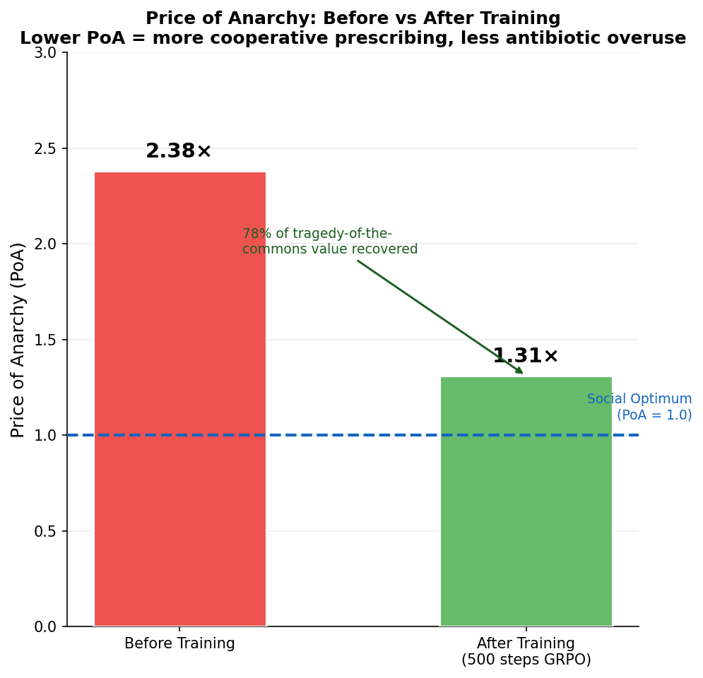

# EpiSteward 🏥

Antibiotic resistance will kill 10 million people a year by 2050.
The main driver isn't biology — it's decisions. EpiSteward trains an
RL agent to make better ones.

## Submission Links

| Deliverable | URL |
|---|---|
| HuggingFace Space | https://huggingface.co/spaces/armaancn/episteward_openenv |
| Training Notebook (Colab) | https://colab.research.google.com/drive/1t1JMl2Iqc5T7w5noUS1C-kwoTr-PnHh4?usp=sharing |
| Code Repository | https://github.com/Armaan-Chris-Noronha/episteward |
| Blog Post | REPLACE_WITH_HF_BLOG_URL |

## What the agent learns that LLMs currently can't do

Current LLMs retrieve antibiotic guidelines. EpiSteward trains an agent
to reason causally about delayed consequences — a culture result 48 hours
later, resistance pressure building across weeks, a ward equilibrium
shifting over months. No prompt engineering teaches this. Only training does.

## Training Evidence


*Training progress over 500 steps — all four objectives improving simultaneously.*


*PoA drops from 2.4 to 1.3 — agent recovers value lost to selfish prescribing.*

## Results

| Agent | Task 1 | Task 2 | Task 3 | Task 4 |
|---|---|---|---|---|
| Random baseline | 0.10 | 0.10 | 0.10 | 0.10 |
| Trained agent | TBD | TBD | TBD | TBD |

*(Updated after onsite GPU training run)*

## Themes Covered
- **Theme 3.1** — World Modeling (Professional Tasks)
- **Theme 1** — Multi-Agent Interactions + Fleet AI bonus
- **Theme 4** — Self-Improvement + Snorkel AI bonus
- **Scaler AI Labs** bonus — Multi-App Enterprise Workflows

## Math Foundations
- Two-compartment population PK/PD with Bayesian MAP estimation
- Itô SDE resistance dynamics (replaces deterministic Wright-Fisher)
- Mutant Selection Window — no other RL environment models this
- Horizontal Gene Transfer ODE with SOS-response amplification
- Bayesian sequential pathogen inference with Value of Information
- Pareto multi-objective reward with adaptive ecological weights
- N-ward game theory — Nash equilibrium, Price of Anarchy

---

## Environment Details

[](https://github.com/openenv)
[](https://www.python.org/)
[](https://hub.docker.com/)
[](LICENSE)


## Math Models

The reward signal is grounded in real pharmacology and epidemiology, not heuristics.

**PK/PD — one-compartment model**

```
C(t) = (F · D / Vd) · exp(−ke · t)     ke = CL / Vd
Effect = Emax · Cⁿ / (EC50ⁿ + Cⁿ)     Therapeutic window: [4×MIC, 64×MIC]
```

**Resistance Evolution — Wright-Fisher process**

```
p(t+1) ~ Binomial(2N, p̃) / 2N
p̃ = p·wR / (p·wR + (1−p)·wS)          wS = 1 − s  (under drug pressure)
```

Resistance emerges when allele frequency > 0.5 sustained > 48 h.

**Network Transmission**

```
P(i→j) = β · w(i,j) · I_i(t) · (1 − immune_j)
β = 0.15 (ESBL)   β = 0.08 (CRK)
```

**Bayesian Resistance Estimation**

```
P(resistant | result) ∝ P(result | resistant) · P(resistant)
```

Prior from local antibiogram; posterior mean + credible interval returned with each observation.

---

## Spaces

### Observation — `EpiObservation`

| Field | Type | Description |
|---|---|---|
| `patient_id` | `str` | Unique patient identifier |
| `ward_id` | `str` | Current ward |
| `infection_site` | `str` | e.g. `urinary_tract`, `bloodstream` |
| `symptoms` | `list[str]` | Clinical presentation |
| `vitals` | `dict[str, float]` | temp, HR, WBC, CRP, procalcitonin |
| `culture_results` | `dict` | Status + sensitivities (may be partial) |
| `resistance_flags` | `list[str]` | ESBL, MRSA, CRE, CRK |
| `transfer_history` | `list[str]` | Ward movement chain |
| `antibiotic_history` | `list[dict]` | Prior prescriptions this episode |
| `network_alert` | `str \| null` | Outbreak broadcast (Task 3 only) |

### Action — `EpiAction`

| Field | Type | Constraints |
|---|---|---|
| `antibiotic` | `str` | 13 agents from colistin to TMP-SMX |
| `dose_mg` | `float` | > 0 |
| `frequency_hours` | `float` | e.g. `8.0` = q8h |
| `duration_days` | `int` | 1–14 |
| `route` | `str` | `IV`, `PO`, `IM` |
| `isolation_order` | `bool` | Contact precautions |
| `culture_requested` | `bool` | Blood/urine/wound culture |
| `specialist_consult` | `bool` | ID consult flag |
| `reasoning` | `str \| null` | Agent explanation (logged, not graded) |

---

## Tasks

### Task 1 — Prescription Triage `[easy]` · 5 steps

Single patient, complete culture data. Agent selects antibiotic + dose; grader checks drug class match, PK/PD therapeutic window, and narrow-spectrum preference. De-escalation on new sensitivity data is rewarded.

| Agent | Score |
|---|---|
| Random baseline | ~0.10 |
| Target (strong) | ≥ 0.85 |

### Task 2 — Resistance Containment `[medium]` · 15 steps

6-patient ESBL *E. coli* cluster in MedWard_A. Agent must identify the index patient, issue isolation orders, and adjust empiric therapy. New resistance cases penalise −0.05/step; correct isolation within 3 steps gives +0.10 bonus.

| Agent | Score |
|---|---|
| Random baseline | ~0.10 |
| Target (strong) | ≥ 0.65 |

Optimal: piperacillin-tazobactam 4500 mg q8h IV + isolation order + cultures.

### Task 3 — Network Outbreak Response `[hard]` · 30 steps

10-hospital CRK network, 2 infected hospitals at start, **finite colistin budget (10 uses)**. Agent traces phylogenetic spread, issues hospital-level containment, and allocates last-resort therapy.

```
reward = 0.6 · lives_saved_ratio
       − 0.25 · colistin_overspend_fraction
       − 0.15 · resistance_amplification_fraction
```

| Agent | Score |
|---|---|
| Random baseline | ~0.10 |
| Target (strong) | ≥ 0.65 |

---

## Setup

**Local (in-process, no Docker)**

```bash
pip install -e ".[dev]"
python -c "
import asyncio
from episteward import EpiStewardEnv

async def run():
    env = EpiStewardEnv.in_process()
    obs = await env.reset('task1_triage')
    print(obs.observation.model_dump())

asyncio.run(run())
"
```

**Docker**

```bash
docker build -t episteward .
docker run -p 7860:7860 episteward
curl -X POST http://localhost:7860/reset \
     -H "Content-Type: application/json" -d '{}'
```

**Baseline inference (LLM agent)**

```bash
export HF_TOKEN=hf_...
export MODEL_NAME=Qwen/Qwen2.5-72B-Instruct
python inference.py
```

---

## API

| Endpoint | Method | Description |
|---|---|---|
| `/` | GET | `{"status":"ok","env":"episteward"}` |
| `/health` | GET | Liveness probe |
| `/tasks` | GET | List task IDs |
| `/reset` | POST | New episode — empty body `{}` defaults to `task1_triage` |
| `/step` | POST | Submit `EpiAction`, get `StepResult` |
| `/state` | GET | Read-only episode snapshot |
